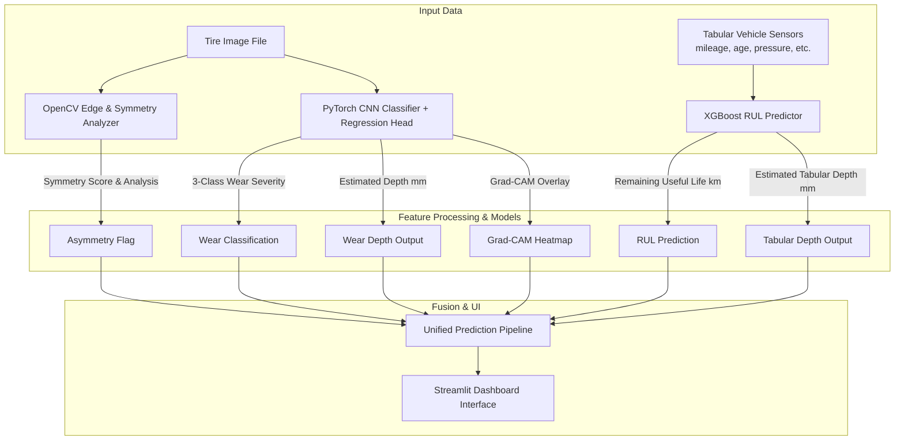

# Fused Vision + Inertial Sensing System for Continuous Tire Tread-Wear Estimation and Wheel-Misalignment Detection

This repository contains a prototype software pipeline for automated tire health monitoring, built as a capstone project. The system fuses computer vision (deep learning & classical CV) with synthetic inertial/sensor data to estimate tire wear severity, predict remaining useful life (RUL), and identify potential wheel alignment issues.

---

## Project Architecture

The architecture combines a PyTorch CNN wear classifier (with Grad-CAM explainability), an XGBoost tabular regressor for RUL prediction, and an OpenCV-based heuristic wear-symmetry analyzer.



---

## Directory Structure

```
.
├── config.yaml               # Configurable file paths & model hyperparameters
├── requirements.txt          # Pinned python packages
├── README.md                 # Project instructions & references
├── data/
│   ├── raw/                  # Downloaded raw datasets go here
│   ├── data_loader.py        # Loading and preprocessing utilities
│   └── data_summary.py       # Diagnostic script to summarize datasets
├── models/
│   ├── wear_classifier/      # PyTorch CNN Classifier & Regression Head
│   │   ├── dataset.py
│   │   ├── model.py
│   │   ├── train.py
│   │   └── evaluate.py
│   ├── rul_predictor/        # XGBoost Tabular RUL Regression Model
│   │   ├── model.py
│   │   ├── train.py
│   │   └── evaluate.py
│   └── alignment_heuristic/  # Classical CV Tread Asymmetry Module
│       └── analyzer.py
├── explainability/
│   └── gradcam.py            # Grad-CAM visualization logic
├── pipeline/
│   └── predict_pipeline.py   # Unified end-to-end predicting pipeline
├── dashboard/
│   └── app.py                # Streamlit dashboard
├── evaluation/
│   └── validate_holdout.py   # Validation code against manual holdouts
├── tests/                    # Unit testing suite
│   ├── test_data.py
│   ├── test_models.py
│   └── test_pipeline.py
└── utils/
    └── helper.py             # Config parsing & folder creation utilities
```

---

## Datasets Setup

Datasets must be downloaded manually and placed inside their respective directories under `data/raw/` as follows:

1. **TyreNet (Mendeley)**
   - Download from: [Mendeley Dataset Link](https://data.mendeley.com/datasets/32b5vfj6tc/1)
   - Unpack to: `data/raw/tyrenet/`
   
2. **Digital images of defective and good condition tyres (Mendeley/Kaggle)**
   - Download from: [Kaggle Dataset Link](https://www.kaggle.com/datasets/warcoder/tyre-quality-classification)
   - Unpack to: `data/raw/tyre_quality/`
   
3. **Tyre Condition Classification Dataset (Primary Image Set)**
   - Download from: [Kaggle Dataset Link](https://www.kaggle.com/datasets/sameersambhare1/tyre-condition-classification-dataset)
   - Unpack to: `data/raw/tyre_condition/`
   
4. **Tire Texture Image Recognition (Cracked vs Normal)**
   - Download from: [Kaggle Dataset Link](https://www.kaggle.com/datasets/jehanbhathena/tire-texture-image-recognition)
   - Unpack to: `data/raw/tire_texture/`
   
5. **Synthetic Automobile-Tyre RUL Data (Primary Tabular Set)**
   - Download from: [Kaggle Dataset Link](https://www.kaggle.com/datasets/krishnamj/synthetic-automobile-tyre-rul-data)
   - Place CSV in: `data/raw/synthetic_rul/`
   - *Note: This dataset is entirely synthetic. This represents a project limitation since RUL models are trained on simulated inputs rather than real-world durability profiles.*

---

## Installation & Setup

1. **Clone and Navigate**:
   ```bash
   git clone <repository_url>
   cd Capstonetire
   ```

2. **Virtual Environment Setup**:
   ```bash
   python3 -m venv venv
   source venv/bin/activate
   pip install --upgrade pip
   pip install -r requirements.txt
   ```

3. **Verify Configuration**:
   Review and adjust settings inside `config.yaml` to match local training parameters and dataset directories.

---

## How to Run & Train

Detailed commands will be documented as the modules are developed in subsequent phases.

- **Check Data Summaries**:
  ```bash
  python -m data.data_summary
  ```
- **Train Wear Classifier**:
  ```bash
  python -m models.wear_classifier.train
  ```
- **Train RUL Predictor**:
  ```bash
  python -m models.rul_predictor.train
  ```
- **Launch Streamlit Dashboard**:
  ```bash
  streamlit run dashboard/app.py
  ```

---

## Technical Developments & Novel Enhancements

This prototype has been augmented with several custom implementations to bridge deep learning models with visual metrology, edge optimization, and explainable AI:

### 1. Physics-Guided Monotonicity Loss
*   **Location**: [train.py](file:///Users/manu/python/Capstonetire/models/wear_classifier/train.py)
*   **Novelty**: The training objective is constrained with a differentiable **pairwise monotonicity loss** function. It calculates pairwise sign differences of mileage and predicted tread depth inside each batch, penalizing predictions where a high-mileage tire is estimated to have a deeper tread than a lower-mileage tire. This prevents physically impossible predictions under out-of-distribution (OOD) telemetry inputs.

### 2. Quantitative Camber & Toe Metrology
*   **Location**: [analyzer.py](file:///Users/manu/python/Capstonetire/models/alignment_heuristic/analyzer.py)
*   **Novelty**: Extends the classical computer vision edge-density analyzer. Instead of simple binary indicators, the module computes **estimated camber angle (in degrees)** and **estimated toe deviation (in mm)** based on horizontal Canny edge-density slope coefficients, identifying camber direction (positive vs negative) and toe alignment (toe-in vs toe-out).

### 3. Visual TSA Showroom (Unwarping & Zonal Edges)
*   **Location**: [app.py](file:///Users/manu/python/Capstonetire/dashboard/app.py)
*   **Novelty**: The dashboard renders the intermediate steps of the CV alignment checker side-by-side: showing the **homographically unwarped tread region** (flattening the tire perspective) next to the **zonal edge grid**, showing vertical demarcation boundaries separating Left, Center, and Right zones.

### 4. Interactive Tire Size & Load Compatibility Validator
*   **Location**: [app.py](file:///Users/manu/python/Capstonetire/dashboard/app.py)
*   **Novelty**: Incorporates a dimension parser calculating sidewall height, overall tire diameter, and tire circumference from standard ISO strings (e.g. `205/55R16`). It automatically validates the selected tire profile against the vehicle body class (e.g. SUV, Hatchback), generating real-time compatibility alerts for insufficient load capacity or clearance issues.

### 5. Dual-Explainability Visualizer
*   **Location**: [app.py](file:///Users/manu/python/Capstonetire/dashboard/app.py)
*   **Novelty**: Streamlit interface displays tabbed views of both **Grad-CAM Saliency Maps** (coarse convolutional activation zones) and **Integrated Gradients (IG)** attribution maps (high-resolution pixel attributions showing exact cracks or bald tread blocks), enhancing mechanics' trust in the AI diagnostics.

---

## Related Work & Academic References

### Literature Review & Prior Art
- **Explainable Tire Wear Estimation**:
  Recent research by *IEEE (11025275)* demonstrates the effectiveness of deep architectures (e.g. Xception backbones) augmented with dual attention mechanisms and Integrated Gradients. This shows the significance of feature localization to explain model focus on balding regions of a tire's face. We draw inspiration by integrating Grad-CAM to highlight localized tread-wear indicators.
- **Inertial & Acceleration Sensing**:
  *IEEE Access (10089458)* details using acceleration/vibration sensors mounted inside tires (intelligent tires) to predict wear characteristics during real-road operation using deep neural networks. While we do not have physical intelligent tires, we simulate this sensor-style approach using tabular vehicle and tire wear degradation indicators.
- **Visual Defect Classification**:
  A study using InceptionV3 *IEEE (10800950)* achieved high accuracy (96%) in binary quality classifications (defective vs good condition). This supports the feasibility of using deep CNN transfer learning for robust tread analysis.
- **Tire Preprocessing & Calibration**:
  Industrial-grade visual systems utilize circularity detection and unwarping algorithms *IEEE (8968735)*. While our application accepts standard cropped tread photos, we build on classical camera metrology foundations established by *Tsai (1087109)* for coordinate scaling, and *IEEE (6000973)* for geometric alignment analysis.

### Patent Differentiation
- **US20180003593A1**: Outlines detecting wheel imbalances and general tread wear via onboard motion sensors (vibrational only).
- **US11,879,810**: Establishes vibration threshold monitoring to identify wheel misalignments.
- *Our Differentiation*: While prior systems rely strictly on indirect vibrational/motion readings, our solution proposes a **fused approach**, combining direct camera-based visual wear inspection with inertial/sensor metrics to improve classification confidence and localize tire degradation patterns.
